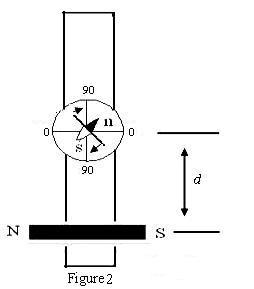
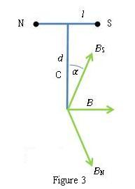
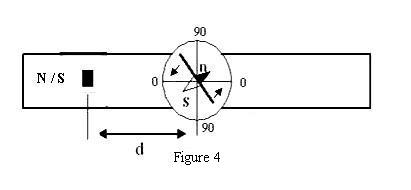
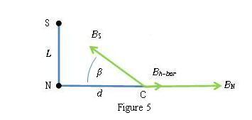

### Theory

The horizontal component of earth's magnetic field, BH, is the component of the magnetic field of the earth along a horizontal plane whose normal vector passes through the center of the earth. BH is measured in Tesla, T.

The magnetic dipole moment m of a magnetic dipole is the property of the dipole which tends to align the dipole parallel to an external magnetic field. m is measured in Ampere-square meters (A m2) or, equivalently, in Joules per Tesla (J/T).

### Tangent law
Consider a bar magnet with magnetic moment m, suspended horizontally in a region where there are two perpendicular horizontal magnetic fields, and external field B and the horizontal component of the earth’s field BH. If no external magnetic field B is present, the bar magnet will align with BH. Due to the field B, the magnet experiences a torque τD , called the deflecting torque, which tends to deflect it from its original orientation parallel to BH. If θ is the angle between the bar magnet and BH, the magnitude of the deflecting torque will be,

$$ \tau=mB\cos \theta $$

The suspended magnet is in equilibrium when,

$$\tau_{r}=\tau_{D}$$

$$mB_{H}\sin\theta=mB\cos\theta$$

$$B=B_{H}\tan\theta..........(1)$$

The above relation, called the tangent law, gives the equilibrium orientation of a magnet suspended in a region with two mutually perpendicular fields.

### Vibration Magnetometer

The equation of motion of the bar magnet suspended horizontally in the earth’s magnetic field is

$$I\ddot{\theta}+mB_{H}\sin\theta = 0$$

Thus its period of oscillation, for small θ , is approximately.

$$T=2\pi\sqrt{I/mB_{H}}..........(2)$$

where I = moment of inertia of the magnet about the axis of oscillation
m = magnetic moment of the magnet
BH = horizontal intensity of the earth's magnetic field.
For a rectangular bar magnet,

$$I=M\frac{L^{2}+b^{2}}{12}..........(3)$$

Where
M = mass of the magnet
L = length of the magnet (longest horizontal dimension)
b = breadth of the magnet (shortest horizontal dimension)

Squaring equation (2)  

$$T^{2}=4\pi^{2}\frac{I}{mB_{H}}.........(4)$$

which gives us, 

$$mB_{H}=4\pi^{2}\frac{I}{T^{2}}............(5)$$

Thus, by measuring vibration (oscillation) period T and calculating the moment of inertia I of the bar magnet, mBH is determined using the vibration magnetometer. We will call this value x

### Working principle
### Tan-A position
In Tan A position (Fig. 1), prior to placement of the magnet, the compass box is rotated so that the (0-0) line is parallel to the arm of the magnetometer. Then the magnetometer as a whole is rotated till pointer reads (0-0). Finally, the bar magnet (the same one that was previously suspended in the Vibration Magnetometer) is placed horizontally, parallel to the arm of the deflection magnetometer, at a distance d chosen so that the deflection of the aluminum pointer is between 30° and 60°.

  

The magnet is a dipole. Suppose that, analogous to an electric dipole, there are two magnetic poles P (though in reality no single magnetic pole can exist), one positive and one negative, separated by a distance L = 2l, with the positive pole labeled N and the negative pole labeled S. By analogy with Coulomb’s law, for each pole we would have a field.

$$B=\frac{\mu_{0}}{4\pi}\frac{P}{r^{2}}$$

$$m=PL=2Pl$$

$$B=\frac{\mu_{0}P}{4\pi}\left[ \frac{1}{(d-l)^{2}}-\frac{1}{(d+l)^{2}} \right]=\frac{\mu_{0}}{4\pi}\frac{2md}{(d^{2}-l^{2})^{2}}$$

where l = L/2 is the half-length of the magnet, 
m = magnetic moment of the magnet, 
4π x 10-7 TmA-1 - the magnetic permeability of free space, and 
θ = deflection of aluminium pointer.

Therefore, by the tangent law, at equilibrium

$$B_{H}\tan\theta=\frac{\mu_{0}}{4\pi}\frac{2md}{(d^{2}-l^{2})^{2}}..........(6)$$

Solving for m/BH we get:

$$\frac{m}{B_{H}}=10^{7}\frac{(d^{2}-l^{2})^{2}}{2d}\times\tan\theta ........(7)$$

We will call this value y.

### Tan-B position

In this position (Fig. 2), prior to placement of the magnet, the compass box alone is rotated so that the (90-90) line is parallel to the arm of the magnetometer. Then the magnetometer as a whole is rotated so that the pointer reads (0-0). Finally, the magnet is placed horizontally, perpendicular to the arm of the magnetometer, at distances d chosen so that the deflection of the aluminium pointer is between 30°and 60°. From Fig. 5, at point C,

  

$$B=B_{H}\sin\alpha+B_{S}\sin\alpha=\frac{2\mu_{0}P}{4\pi}\left( \frac{1}{(d^{2}+l^{2})}\frac{l}{(d^{2}+l^{2})^{1/2}} \right)$$

which leads to,

$$\frac{m}{B_{H}}=\frac{4\pi}{\mu_{0}}(d^{2}+l^{2})^{3/2}\tan\theta.......(8)$$

Equation (8) gives us a second value of y, which we average with the first, from equation (7).

Now using (5), (7) and (8) we can calculate m and BH.

$$mB_{H}=x ...........(9)$$

$$\frac{m}{B_{H}}=y ...........(10)$$

  

Hence, the magnetic moment of the bar magnet is,

$$m=\sqrt{xy}.................(11)$$

And the horizontal component of earth’s magnetic field is,

$$B_{H}=\sqrt{\frac{x}{y}}.............(12)$$

### Tan C position

In this position (Fig. 4), the bar magnet is placed vertically, in contrast to the Tan A and Tan B positions, where it is placed horizontally. The bottom end of the bar magnet is placed a distance d from the center of the compass box, chosen so that the deflection of the aluminum pointer is between 30° and 60°. From Fig. 5, the horizontal component of the field from the bar magnet at the center of the compass is

   
  

$$B_{h-bar}=B_{N}-B_{S}\cos\beta=\frac{\mu_{0}P}{4\pi}\left( \frac{1}{d^{2}}-\frac{1}{(d^{2}+L^{2})}\frac{d}{(d^{2}+L^{2})^{1/2}} \right)$$

which reduces to,

$$B=\frac{\mu_{0}P}{4\pi}\left( \frac{1}{d^{2}}-\frac{d}{(d^{2}+L^{2})^{3/2}}\right)......(13)$$

Where P is the pole strength in Amp-meters (A m) and L is the length of the bar magnet in meters. In equation (1), the horizontal component of the field from the bar magnet BH bar corresponds to the external field B, so we have . Substituting this in (13) and solving for the pole strength P of the bar magnet,

$$P=\frac{4\pi B_{H}\tan\theta}{\mu_{0}\left( \frac{1}{d^{2}}-\frac{d}{(d^{2}+L^{2})^{3/2}}\right)}.........(14)$$

